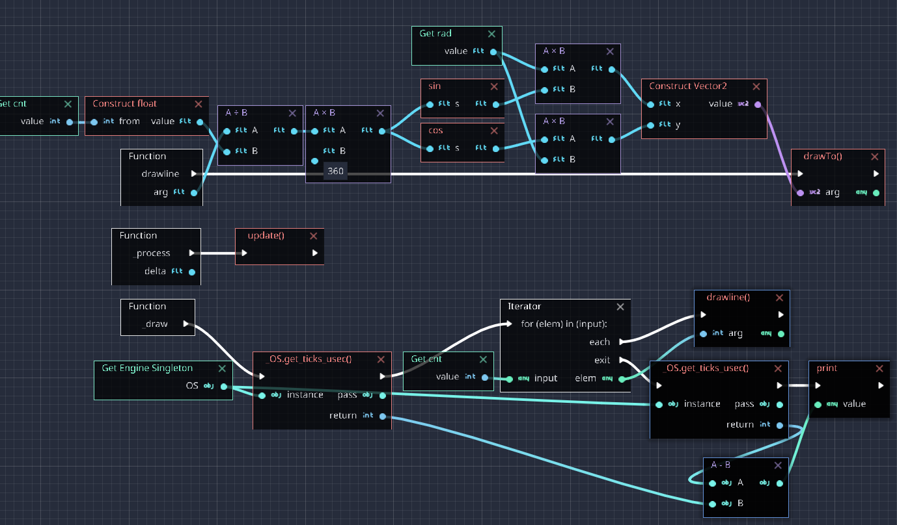

# godot-rust-benchmark

gdscript vs. visual scripting vs. gdnative (rust)

Task: 6k DrawLine using `sin`/`cos` in a circle

## Results

| type|usecs | factor| 
|---|---|---|
| gdnative (rust) | ~1000 usec | - |
| gdscript | ~5000 usec | 5x |
| visual script | ~7000 usec | 7x |


## Code

### GDScript

```
var startTime = OS.get_ticks_usec()
var start = Vector2(200,200)

var cntf = float(cnt)
var rad = 200
for n in range(cnt):
    var x = sin(n/cntf * 360.0)*rad
    var y = cos(n/cntf * 360.0)*rad
    draw_line(start, start+Vector2(x, y), Color(255, 0, 0), 1,false)

print("bench: " + String(OS.get_ticks_usec() - startTime))
```

### GDNative using godot-rust

```rust
let start_time = OS::godot_singleton().get_ticks_usec();

let cntf = self.cnt as f32;

for n in 0..self.cnt {
    let x = f32::sin(n as f32 / cntf * 360.0) * self.rad;
    let y = f32::cos(n as f32 / cntf * 360.0) * self.rad;
    let target = Vector2::new(x, y) + self.start;

    owner.draw_line(self.start, target, Color::rgb(0.0, 0.0, 1.0), 1.0, false)
}

godot_print!(
    "bench: {}",
    OS::godot_singleton().get_ticks_usec() - start_time
);
```

### Visual Script

